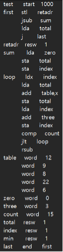
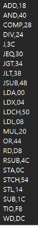
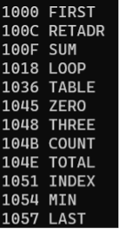
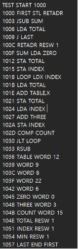
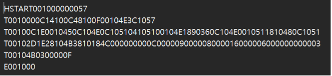

# 2Pass Assembler

### 입력
#### 1. 소스파일(SIC) 
- SIC 시뮬레이터에서 사용하는 소스파일 형식 그대로 사용한다.
- 

#### 2. OPTAB
- 소스파일에서 사용된 opcode를 포함하도록 파일 형태로 작성한다.
- 각 라인은 "LDA 00" 처럼
- 

### 출력
#### 1. SYMTAB
- 메모리 상에 위치한다.
- SYMTAB 구조 및 내용을 콘솔에 출력한다.
- 

#### 2. INTFILE : 중간파일
- Pass1의 출력으로, 파일 형태로 출력한다.
- 

#### 3. OBJFILE
- Pass2의 출력으로, 파일 형태로 출력한다.
- 
 

### 알고리즘
#### 1. 사용 언어 : C++
#### 2. 소스 파일 : main.cpp, header.h
#### 3. 출력 파일 : INTFILE, OBJFILE, SRCFILE