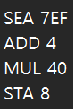
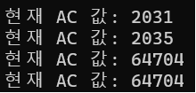
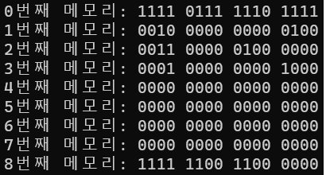
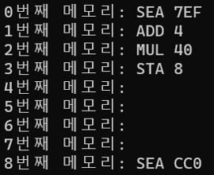
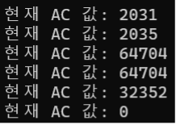
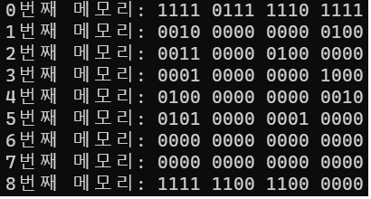
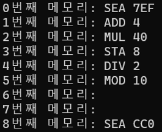

# CPU 연산 
### 문제 분석
> Cpu와 Memory의 동작을 하는 클래스를 만든다.
1. **메모리 읽기**
 - 방법1 : 현재 메모리 포인터가 가리키는 주소의 메모리를 읽는다.
 - 방법2 : 특정 주소의 메모리를 읽는다.
2. **메모리 쓰기**
 - 방법1 : 현재 메모리 포인터가 가리키는 주소부터 쓴다.
 - 방법2 : 특정 주소부터 쓴다.
3. **메모리 초기화**
 - 방법1 : 메모리 전체를 0으로 초기화 한다.
 - 방법2 : 특정 주소부터 0으로 초기화 한다.
 - 방법3 : 메모리 전체를 임의의 값으로 초기화 한다.
4. **메모리 포인터 설정**
 - 방법1 : 메모리의 시작주소로 설정한다.
 - 방법2 : 임의의 입력한 주소로 변경한다.
5. **메모리 내용 보기**
 - 방법1 : 전체 메모리 내용 보기
 - 방법2 : 특정 주소의 메모리 내용 보기
 - (16진수/2진수 는 선택할 수 있다.)

 

### 코드 구조
> CPU16.h
1. **clss CPU16** 
 - Cpu 역할을 한다.
2. **class Memory** 
 - Memory 역할을 한다.
3. **int strTodec(string str)** 
 - 16진수로 표현된 숫자를 10진수 표현으로 바꾼다.
4. **string decTohex(int num)**
 - 10진수로 표현된 숫자를 2진수 표현으로 바꾼다.
5. **string decTobin(int num)** 
 - 10진수로 표현된 숫자를 16진수 표현으로 바꾼다.
> test.cpp
 - class CPU16과 memory의 객체를 만든다.
 - 실행 프로그램을 입력하고 계산을 수행한다.
 - AC 레지스터의 값을 명령어 한 줄 마다 콘솔에 출력한다.

 

### 입력과 출력
> 명령어 파일1(PROGA.txt) 
- PROGA.txt  

- AC register 값 확인  

- memory의 한 주소 안에 연산자(명령어)와 피연산자를 모두 담는다. 
- 8 번째 메모리는 STA 8 명령어로 8 번째 메모리에 AC 레지스터 값을 저장한다.
- 8 번째 메모리는 오버플로우가 발생한 것을 확인할 수 있다.
 

> 명령어 파일2(PROGB.txt)
- PROGB.txt  

- AC register 값 확인  

- memory의 한 주소 안에 연산자(명령어)와 피연산자를 모두 담는다. 
- 8 번째 메모리는 STA 8 명령어로 8 번째 메모리에 AC 레지스터 값을 저장한다.
- 8 번째 메모리는 오버플로우가 발생한 것을 확인할 수 있다.
 

 

### 알고리즘
#### 1. 사용 언어 : C++
#### 2. 소스 파일 : test.cpp, CPU16.h
#### 3. 출력     : console